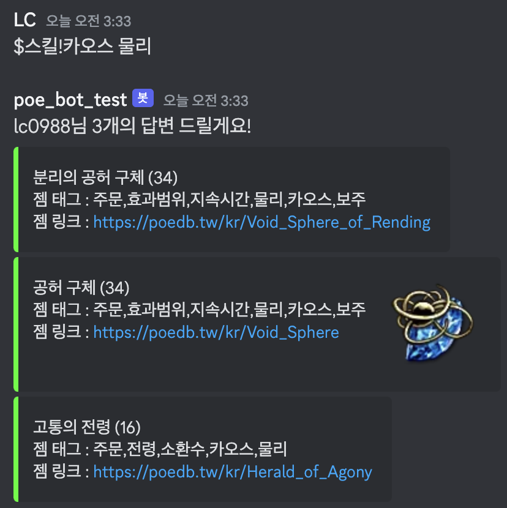

# POE Discord Bot

- JDA Library 를 통한 챗봇 활성화
- Discord Developer 연동 (Oauth)

---

사용 

slash 명령어 [x]

onMessageReceived [O]
- 메시지를 감지하여, 해당 명령어에 부합하는 경우 message return
- 메세지 형식 : Embed , Component

---

### 명령어

- $젬
- $직업노드
- $스킬 / $보조
- $site / $사이트

---

### 예시

--- 

참고

[디스코드 개발 Docs](https://discord.com/developers/docs/intro)

[JDA Documentation](https://github.com/discord-jda/JDA)

[embed-Builder](https://autocode.com/tools/discord/embed-builder/)
